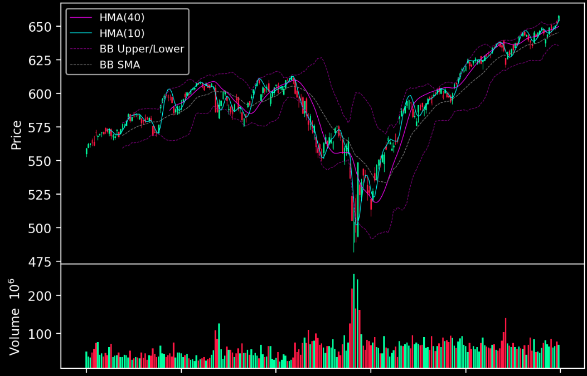
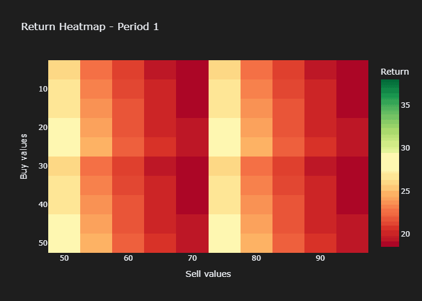
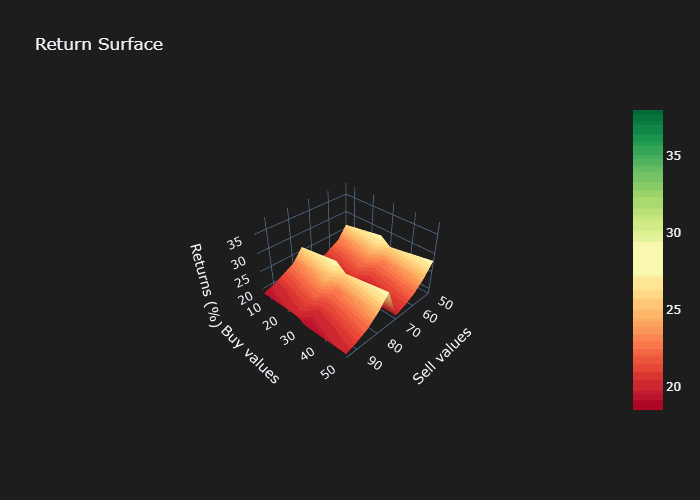
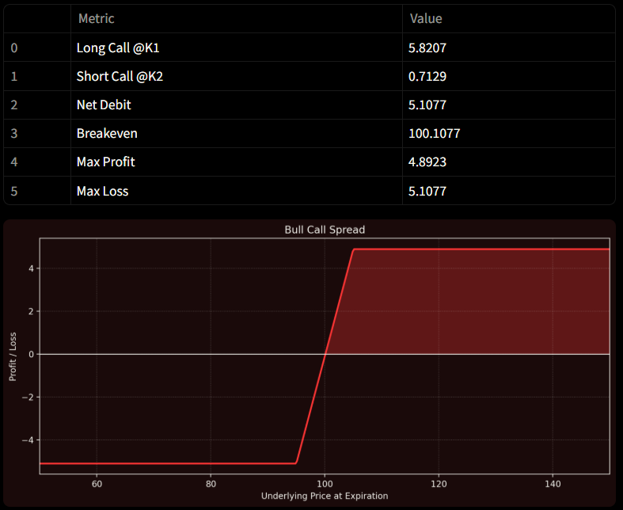

# Michael Bernier's Projects

Portfolio of finance and data applications.
Each project includes its own README with installation and usage details.

## Current Highlights

### Static Dashboard
Streamlit app displaying candlestick charts and technical indicators based on user watchlists.

### 4-Dimensional Visualizations
Animated Heatmaps and 3D Surfaces using Plotly. Created as html documents and gifs.

### Option Pricing Tools
Pricing calculators with plots for various strategies and scenarios.

## Setup

Clone the repository and open any project folder to view its README for instructions.

git clone https://github.com/mbernier4453/Projects.git

## Roadmap

Replace static dashboard with dynamic one + connect live data feed api.

Broaden visualization library with new chart types and animations.

Expand pricing utilities and risk analysis features.

## Conventions

Python 3.10+.

Separate folders for dashboard, visuals, and options.

## License

MIT License.
